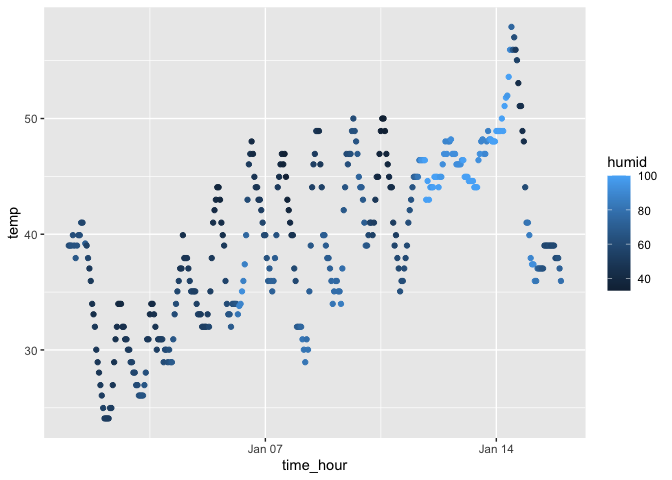

p8105_hw1_jx2562
================
Jingyi
2023-09-15

# Problem 1

Here we use ggplot to scatter the correlation between *temp* and
*time_hour*, with *humid* indicating the color of the points.

Load the libraries (**moderndive** and **ggplot**) and dataset
(**early_january_weather**) we are going to use.

``` r
library(moderndive)
library(ggplot2)
data("early_january_weather")
```

The dataset **early_january_weather** include 15 columns and 358 rows.

The variables in the dataset includes *origin, year, month, day, hour,
temp, dewp, humid, wind_dir, wind_speed, wind_gust, precip, pressure,
visib, time_hour*.

The mean of the temperature in the early january is 39.5821229.

``` r
ggplot(data = early_january_weather, aes(x = time_hour, y = temp, color = humid)) +
  geom_point()
```

<!-- -->

``` r
ggsave("temp over time.jpg")
```

    ## Saving 7 x 5 in image

It is apparent from the graph that as time pass by, the temperature grew
gradually with fluctuation. In terms of humidity, it rose up and reached
its summit in January 14.
